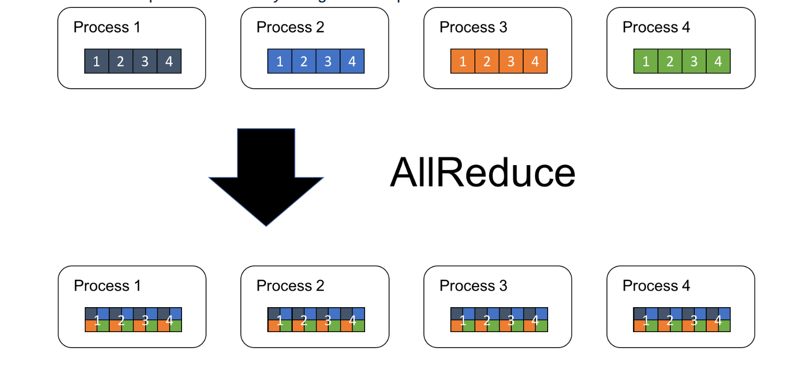
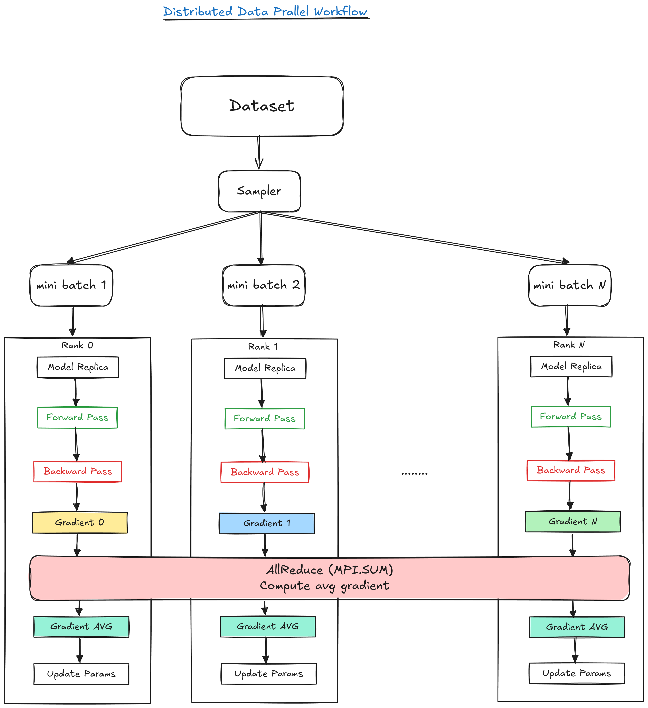

# 1. What is Distributed Data Parallel?

Distributed Data Parallel (DDP) is a training strategy where multiple processes (GPUs) each hold a replica of the model. Every process gets a different subset of the data (hence “data parallel”) called mini-batches, computes forward and backward passes locally, and then synchronizes gradients across processes so that the model updates stay consistent globally.

# 2. How does Distributed Data Parallelism work?

Let’s assume we have:

- $N$ processes (each on a GPU or node).
- Each process has the same model replica.
- Each process gets a different mini-batch.

Here's what happens per training iteration:

### 2.1 Forward Pass (Local)

Each process computes the forward pass locally:
$$y_i  =f(x_i,\theta)$$

where $f$ is the forward computational graph, $x_i$ is the input (at process $i$) and $\theta$ are the local model parameters (initially identical across all process)

### 2.2 Backward Pass (Local Gradient Calculation)

Each process independently computes gradients from its local loss:
$$g_i =\nabla_\theta L_i(f(x_i,\theta), y^{target}_i)$$

### 2.3 Gradient Synchronization (Global Gradient Calculation/Averaging)

*Here’s where distributed data parallelism kicks in*. We want to compute the global gradient as an average of the local gradients:

$$g_{avg} = \frac{1}{N}\sum_{i=1}^{N} g_i$$

This is done using the `AllReduce` operation (implemented by the backend like NCCL, GLOO, MPI, etc.) that does the following:

1. **Apply a reduction** (`sum` in this case) **to the gradients** across all processes.
2. **Distribute** the result to all processes.

A visual illustration of `AllReduce` is shown in Figure 2.

|  |
|:--:|
| *Figure 2: AllReduce Operation. Source: [tech.preferred.jp](https://tech.preferred.jp/wp-content/uploads/2018/07/fig_1.png)* |

### 2.4 Parameter Update (Local Update Using Global Gradients)

Once the gradients are synchronized, each process updates the model parameters:

$$\theta^{(t+1)} \leftarrow \theta^{(t)} - \alpha \cdot g_{avg}$$

where $\theta^{(t)}$ are the model parameters at iteration $t$, $\alpha$ is the learning rate, and $g_{avg}$ is the average gradient computed in the previous step.

This ensures all model replicas stay synchronized.

### 2.5 Gradient Bucketing: Reducing Communication Overhead

Each tensor in our model has its own gradient. Naively, we’d call `AllReduce` per tensor...a bit inefficient. Instead, we batch them together:

- **Group gradients into larger "buckets"**
- **Flatten** them into a single contiguous buffer
- **Call `AllReduce` once per bucket**, not per tensor

This reduces communication overhead significantly.

>Imagine sending letters (gradients) from one office (GPU) to another. Naively, we'd send each letter in its own envelope (one `AllReduce` per tensor), wasting time and postage. Instead, we collect many letters, put them in one big envelope (bucket), and send it all at once (one `AllReduce` per bucket). Same contents delivered, with less overhead.

Figure 2. shows the summary of the DDp

|  |
|:--:|
| *Figure 1: Distributed Data Parallel Workflow.* |

# 3. Implementation of DDP in LizarDist

When I first started building LizarDist, it was just meant to be a small exercise from Jacob Hilton’s [Deep Learning Curriculum]( https://github.com/jacobhilton/deep_learning_curriculum). LizarDist evolved into a more in depth exploration of distributed training strategies. I didn’t stop at basic data parallelism, I explored other strategies like pipeline and model parallelism that will be included in this minimal framework.

At its core, LizarDist is my sandbox to understand how strategies like Data Parallelism actually work. Let's break it down.

## 3.1 Process Initialization and Communication Backend

Each process in LizarDist is spawned using `mpiexec` and wrapped with a `Communicator` object that abstracts over the low-level MPI communication layer.

```python
from lizardist.distributed.communicator import Communicator

comm = Communicator()
rank = comm.get_rank()
world_size = comm.get_world_size()
```

This Communicator internally holds:

- A reference to `MPI.COMM_WORLD`
- Rank and world size
- Communication tracking (number of AllReduce calls, bytes sent)
- Optional gradient bucketing logic for communication efficiency

All MPI ops like `AllReduce`, `bcast`, `gather`, and `barrier` are wrapped inside this communicator for easier integration and stats tracking.

### 3.2 Model Replication and Weight Broadcast

Each process creates its own instance of the model:

```python
model = Model().to(device)
```

But to ensure all processes start with **identical weights**, only **rank 0** initializes the parameters. We then use MPI’s broadcast mechanism to share them across all other processes:

```python
sync = Synchronizer(comm)
sync.broadcast_parameters(model)
```

This uses:

```python
self.comm.bcast(param_np, root=root)
```

to send a copy of each parameter to all other ranks. This prevents silent divergence due to initialization randomness.

### 3.3 Manual Dataset Sharding

Unlike PyTorch’s built-in [`DistributedSampler`](https://docs.pytorch.org/docs/stable/data.html#torch.utils.data.distributed.DistributedSampler), I implemented manual dataset sharding for transparency:

```python
dataset = datasets.MNIST("../data", train=True, download=True, transform=transform)

shard_size = len(dataset) // world_size
start_idx = rank * shard_size
end_idx = dataset_size if rank == world_size - 1 else start_idx + shard_size

dataset = torch.utils.data.Subset(dataset, range(start_idx, end_idx))
train_loader = DataLoader(dataset, batch_size=batch_size, shuffle=True)
```

Each process gets a **non-overlapping subset** of the dataset, ensuring full dataset coverage without duplication.

### 3.4 Gradient Synchronization: The Core of DDP

Once each process computes its local loss and calls `loss.backward()`, its `.grad` fields contain gradients with respect to local data. These need to be averaged across all processes to ensure that each optimizer step is globally consistent.

Here’s where the `Synchronizer` kicks in:

```python
loss.backward()
sync.sync_gradients(model, use_bucketing=True)
optimizer.step()
```

This does the following:

- Gathers all `.grad` tensors from the model
- Detaches and converts them to NumPy arrays (for MPI compatibility)
- Performs `AllReduce` across processes using:
  - **One call per tensor** (if bucketing is off)
  - **Concatenated bucketed reduction** (if bucketing is on)
- Averages the result by dividing by `world_size`
- Writes the result back to the `.grad` field using:

```python
param.grad.copy_(torch.from_numpy(avg_grad).to(param.device))
```

### 3.5 Bucketing Strategy: Optimize AllReduce

Calling AllReduce for each tensor individually incurs a lot of overhead. To reduce this, I implement gradient bucketing:

```python
results = []
current_bucket: list[np.ndarray] = []
current_size = 0

for tensor in tensors:
    if current_size + tensor.nbytes > self.bucket_size:
        reduced_bucket = self._allreduce_bucket(current_bucket)
        results.extend(split_into_original_shapes(reduced_bucket))
        current_bucket = []
        current_size = 0
    current_bucket.append(tensor)
    current_size += tensor.nbytes

```

- Gradients are concatenated into a flat buffer
- We perform one `AllReduce` on the buffer
- We split the result and reshape each gradient back into its original shape

The bucketing size is configurable (`bucket_size` in bytes) and tracked for performance diagnostics. The table below compares key communication metrics with and without bucketing for a simple CNN model:

| Metric                | With Bucketing | Without Bucketing | Ratio (With / Without) |
|-----------------------|---------------|--------------------|-------------------------|
| Average Bytes/Call   | 827,688       | 103,461            | ~8x larger              |
| Total Allreduce Calls | 235            | 1880               | ~8x fewer               |
| Total Bytes Sent      | 194,506,680    | 194,506,680        |  same            |

**Bucketing leads to fewer allreduce calls with larger average data per call**, making communication more efficient overall.
The code for this is in the [Communicator Class](https://github.com/adelbennaceur/lizardist/blob/889833333fde4fa94444da93ef3b71edc9996813/lizardist/distributed/communicator.py#L70).

### 3.6 Optimizer Step: Same as Standard PyTorch

After gradient synchronization, each process performs a local optimizer step:

```python
optimizer.step()
```

But because gradients have already been averaged across ranks, this ensures consistent weight updates across ranks. There’s no need for additional sync.

### 3.7 Full Example Training Loop

Here is the key training loop:

```python
for epoch in range(epochs):
    for batch_idx, (data, target) in enumerate(train_loader):
        data, target = data.to(device), target.to(device)

        optimizer.zero_grad()
        output = model(data)
        loss = criterion(output, target)
        loss.backward()

        sync.sync_gradients(model, use_bucketing=True)

        optimizer.step()
```

That’s it. The rest of the training pipeline is pure PyTorch. The only change is intercepting the gradient sync step before `optimizer.step()`.

### 3.8 Pitfalls (Ask Me How I Know…)

- Forgetting to divide reduced gradients by world size → effective learning rate scales with number of processes → divergence.
- Using too small bucket sizes → too many AllReduce calls → kills performance.
- Not syncing gradients before optimizer.step() → models silently diverge → wasted compute.

# 4. Conclusion

If you're If you're curious about how DDP works under the hood in more details, [the PyTorch DDP paper](https://arxiv.org/abs/2006.15704) is a solid starting point. In parallel, I’ve been building [LizarDist](https://github.com/adelbennaceur/lizardist), my own minimal distributed training library. It reimplements core ideas from DDP. For those new to MPI, this [MPI tutorial](https://mpitutorial.com/tutorials/) is a great resource. I also highly recommend Hugging Face’s [Ultra-Scale Training Playbook](https://huggingface.co/spaces/nanotron/ultrascale-playbook) it offers practical insights into scaling strategies and real-world engineering trade-offs.

👉 In future posts, I’ll walk through pipeline parallelism, tensor parallelism, and hybrid strategies I've been implementing in LizarDist.
